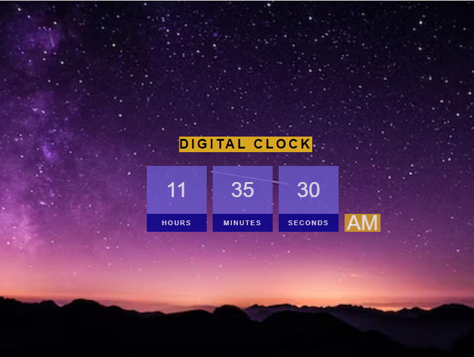

## **Introduction**
Digital clock is a simple web-based application created as a part of practise on HTML, CSS and JavaScript. 

## **Detail**
Here, I have made a clock which sync with the local timewhen operated.

## ****Display****
  
